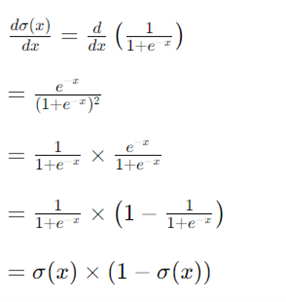

# Assignment 01: Understanding and Implementing the Activation
## 1. Theoretical Understanding
### 1.1.1 What is an Activation Function?
An activation function, also known as a transfer function, is a mathematical operation applied to the weighted sum of inputs within a neuron in a neural network. It introduces non-linearity, preventing the network from simply stacking linear functions and enabling it to model complex relationships between inputs and outputs.


### 1.1.2 Equation and Graph:
There are several types of activation functions commonly used in neural networks, including sigmoid, tanh, ReLU (Rectified Linear Unit), Leaky ReLU, Exponential Linear Unit (ELU) Scaled Exponential Linear Unit (SELU), Softmax and Swish Function.

#### 1. Sigmoid Function (Logistic Function):
The sigmoid function, also known as the logistic function, is a smooth, S-shaped curve that maps any real-valued number to a value between 0 and 1. It is mainly used in the output layer of binary classification tasks. It is historically popular. Its tendency to saturate and the vanishing gradient problem limit its effectiveness in deeper networks.

##### Equation:

##### Graph:


#### 2. Hyperbolic Tangent Function (tanh):
The hyperbolic tangent function is similar to the sigmoid function but maps any real-valued number to a value between -1 and 1. Hyperbolic Tangent Function is also prone to the vanishing gradient problem but is preferred for its zero-centered output, which aids in faster convergence.

##### Equation:

##### Graph:


#### 3. Rectified Linear Unit (ReLU):
The Rectified Linear Unit (ReLU) is a piecewise linear function that returns 0 for negative inputs and the input value for non-negative inputs. It is currently the most widely used activation function due to its simplicity and effectiveness. It avoids the vanishing gradient problem and accelerates convergence, making it suitable for deep neural networks.
##### Equation:
    ReLU(x) = max (0, x)

##### Graph:


#### 4. Leaky ReLU:
The Leaky ReLU function is a variant of ReLU that allows a small, non-zero gradient for negative inputs, preventing the "dying ReLU" problem.

##### Equation:

where α is a small positive constant.
##### Graph:


#### 5. Exponential Linear Unit (ELU):
The Exponential Linear Unit (ELU) is a variant of ReLU that introduces an exponential term for negative inputs. It offers improved robustness to the saturation problem observed in ReLU. It ensures smooth gradients for both positive and negative inputs.

##### Equation:

where α is a small positive constant.
##### Graph:


#### 6. Scaled Exponential Linear Unit (SELU):
The Scaled Exponential Linear Unit (SELU) is a type of activation function commonly used in deep neural networks. It is specifically designed to address the issue of vanishing and exploding gradients by promoting self-normalization within the network architecture. SELU maintains the mean and variance of the activations across layers, which helps in stabilizing the training process and improving the convergence of deep networks.

##### Equation:

where α and λ are constants.
##### Graph:


#### 7. Softmax Function:
The softmax function is commonly used in the output layer of neural networks for multi-class classification tasks. It is applied to the raw output scores (logits) from the preceding layer and transforms them into probabilities. This transformation ensures that the sum of probabilities across all classes equals 1, making it suitable for classification tasks where an input can belong to only one class.

##### Equation:

where xi represents the raw score for class i, and N is the total number of classes.
##### Graph:


#### 8. Swish Function:
The Swish activation function, introduced by Ramachandran et al., is another type of activation function that has gained attention in neural network research. It is defined as the element-wise multiplication of the input with the sigmoid function applied to the input.
##### Equation: 

    Swish(x) =  x × sigmoid(x)

##### Graph:


#### 1.2 Why activation functions are used in neural networks?

Activation functions play a crucial role in neural networks, introducing non-linearity and enabling them to model complex relationships between inputs and outputs. Here's a detailed exploration of their roles:
- Introduction of Non-Linearity: Without activation functions, a neural network would essentially be a stacked chain of linear functions. Such a network could only represent straight lines, severely limiting its ability to learn and model the intricate patterns present in real-world data. Activation functions inject non-linearity into the network, allowing it to capture more complex relationships like curves, circles, and even non-smooth patterns. Imagine trying to classify handwritten digits. A linear model could struggle to differentiate between a '6' and a '9' as both share similar slopes. An activation function, like ReLU, can create more nuanced decision boundaries, enabling the network to learn these subtle differences.
- Controlled Output Range: Many activation functions confine their output to a specific range, typically between 0 and 1 (e.g., Sigmoid) or -1 and 1 (e.g., Tanh). This controlled range plays several crucial roles:
    - Gradient Flow: During training, the network uses backpropagation to learn by adjusting its weights based on the error signal. A bounded output range ensures that gradients don't explode or vanish into oblivion, facilitating smoother learning and convergence.
    - Interpretability: For certain tasks like classification, having outputs between 0 and 1 can be inherently interpretable as probabilities, aiding in understanding the network's reasoning.

- Building Blocks for Complex Architectures: Activation functions provide the essential building blocks for constructing powerful neural networks. By stacking multiple layers of neurons, each equipped with an activation function, we create a network capable of representing increasingly complex functions. Layers act as feature extractors, learning increasingly abstract representations of the input data as it flows through the network. Think of each layer as adding a layer of complexity to the model. Activation functions help build these layers, allowing the network to learn even the most intricate patterns in the data.
- Diverse Functions for Different Tasks: Different activation functions have distinct characteristics, making them suitable for various tasks:
    - Sigmoid: While versatile, its gradient can become vanishing in deep networks.
    - ReLU: Popular for its computational efficiency and vanishing gradient resistance.
    - Tanh: Similar to Sigmoid but has a zero-mean output, useful for certain architectures.
    - Softmax: Primarily used for multi-class classification, ensuring outputs sum to 1 and represent probabilities.
    - Swish: A newer function that has shown promising results in certain scenarios.
    - Leaky ReLU, ELU, and SELU: Variants of ReLU that address its limitations and have shown improved performance in deep networks.

Choosing the right activation function for a specific task can significantly impact the network's performance and learning dynamics.

In conclusion, activation functions are vital for:
- Enabling neural networks to learn complex, non-linear relationships.
- Controlling the output range for smoother learning and interpretability.
- Building powerful network architectures by stacking layers.
- Matching the network's capabilities to specific tasks through varied activation functions.

## 2. Mathematical Exploration:
### 2.1 Derive the Activation function formula and demonstrate its output range. 
Let's derive the formula for the sigmoid activation function and then calculate its derivative. The sigmoid activation function is defined as:
 
To demonstrate its output range, we'll show that the output of the sigmoid function always lies between 0 and 1 for any real-valued input x.

#### Output Range of Sigmoid Function:

**Lower Bound:** As x approaches negative infinity, e^(-x) approaches infinity, and the denominator (1+e)^(-x) approaches infinity. Therefore, 1/(1+e^(-x))  approaches 0.
	
**Upper Bound:** As x approaches positive infinity, e^(-x) approaches 0, and the denominator (1+e)^(-x) approaches 1. Therefore, 1/(1+e^(-x))  approaches 1.


Thus, the output of the sigmoid function is bounded between 0 and 1 for any real-valued input x.

### 2.2 Calculate the derivative of the Activation function and explain its significance in the backpropagation process.

#### Derivative of Sigmoid Function:
Now, let's calculate the derivative of the sigmoid function σ (x) with respect to x. This derivative is crucial for the backpropagation process in training neural networks.
Using the quotient rule, we have:

The derivative of the sigmoid function is given by σ (x) × (1 - σ (x)).

#### Significance in Backpropagation:
The derivative of the sigmoid function plays a crucial role in the backpropagation process during neural network training. It represents the gradient of the sigmoid activation function with respect to its input x. This gradient indicates how the output of the sigmoid function changes concerning small changes in its input.

During backpropagation, the calculated derivative is used to update the weights of the neural network in the direction that minimizes the loss function. It helps adjust the parameters of the network to minimize the error between the predicted output and the actual output, thus enabling the network to learn from the training data. The sigmoid function's derivative being a function of its own output helps propagate gradients effectively through the network layers during the optimization process.

## 3. Programming Exercise:
- Implement the Activation Function in Python. Use the following prototype for your function: 
    ```python
    def Activation_Function_Name(x): 
    #Your implementation 
    ```

- Create a small dataset or use an existing one to apply your function and visualize the results.
#### Code Implementation:


```python
import numpy as np
import matplotlib.pyplot as plt

# Define activation functions
def sigmoid(x):
    return 1 / (1 + np.exp(-x))

def tanh(x):
    return np.tanh(x)

def relu(x):
    return np.maximum(0, x)

def leaky_relu(x, alpha=0.01):
    return np.where(x > 0, x, alpha * x)

def elu(x, alpha=1.0):
    return np.where(x > 0, x, alpha * (np.exp(x) - 1))

def selu(x, alpha=1.6732632423543772848170429916717, scale=1.0507009873554804934193349852946):
    return scale * np.where(x > 0, x, alpha * (np.exp(x) - 1))

def softmax(x):
    exp_vals = np.exp(x - np.max(x, axis=-1, keepdims=True))
    return exp_vals / np.sum(exp_vals, axis=-1, keepdims=True)

def swish(x):
    return x * sigmoid(x)

# Activation functions dictionary
activation_functions = {
    'Sigmoid': sigmoid,
    'Tanh': tanh,
    'ReLU': relu,
    'Leaky ReLU': leaky_relu,
    'ELU': elu,
    'SELU': selu,
    'Softmax': softmax,
    'Swish': swish
}

# Create a small dataset
x = np.linspace(-10, 10, 100)

# Create subplots for each activation function
rows, cols = 4, 2
fig, axs = plt.subplots(rows, cols, figsize=(12, 16))

for i, (name, activation_func) in enumerate(activation_functions.items()):
    row = i // cols
    col = i % cols
    y = activation_func(x)
    axs[row, col].plot(x, y, color='red')
    axs[row, col].set_title(name)
    axs[row, col].grid(True)

# Adjust layout
plt.tight_layout()
plt.show()
```

#### Output:


## 4. Analysis:
### 4.1 Analyze the advantages and disadvantages of using the Activation Function in neural networks.
#### 4.1.1 Advantages:
- **Enable Non-Linearity:** Without them, neural networks could only model linear relationships, severely limiting their capabilities. Activation functions unlock the ability to learn complex, non-linear patterns present in real-world data.
- **Controlled Output Range:** Many activations restrict output to a specific range (e.g., 0-1, -1-1). This aids in:
    - **Gradient Flow:** Ensures gradients don't explode or vanish during backpropagation, facilitating smoother learning and convergence.
    - **Interpretability:** For tasks like classification, outputs between 0-1 can represent probabilities, aiding in understanding the network's reasoning.
- **Building Blocks for Deep Architectures:** Stacking layers with activations creates networks capable of capturing increasingly complex relationships. Each layer acts as a feature extractor, learning more abstract representations of the data.
- **Variety for Different Tasks:** Different activations have unique characteristics, making them suitable for specific tasks:
    - ReLU: Efficient, popular for vanishing gradient resistance.
    - Tanh: Similar to Sigmoid but zero-centered, useful for certain architectures.
    - Softmax: For multi-class classification, ensuring outputs sum to 1 and represent probabilities.

#### 4.1.2 Disadvantages:
- **Computational Cost:** Some activations (e.g., Sigmoid) can be computationally expensive, impacting training speed for large networks.
- **Vanishing/Exploding Gradients:** Certain activations (e.g., Sigmoid) can exacerbate vanishing gradients in deep networks, making learning difficult. Others (e.g., ReLU) might suffer from exploding gradients.
- **Choice Matters:** Selecting the wrong activation can hinder performance. Understanding their characteristics and task requirements is crucial.


### 4.2 Discuss the impact of the Activation function on gradient descent and the problem of vanishing gradients.

Impact of Activation Function on Gradient Descent:
1.	**Vanishing Gradients:**
    - Activation functions with derivatives that tend to approach zero for extreme input values can lead to vanishing gradients during backpropagation. When gradients become very small, the updates to the network weights also become insignificant, causing slow or stalled learning.
    - This phenomenon is particularly problematic in deep networks with many layers, as the gradients have to pass through multiple activation functions, compounding the effect of vanishing gradients as they propagate backward through the network.
2.	**Convergence Speed:**
    - The choice of activation function influences the convergence speed of the gradient descent algorithm. Activation functions with steeper gradients, such as ReLU and its variants (e.g., Leaky ReLU, ELU), allow for faster convergence compared to functions with saturating gradients like sigmoid and tanh.
    - Faster convergence speeds are desirable as they lead to quicker training times and require fewer iterations to reach an acceptable level of performance.
3.	Smoothness and Stability:
    - The smoothness and stability of the activation function affect the behavior of gradient descent. Activation functions with smooth derivatives promote more stable training dynamics and smoother optimization landscapes, facilitating more robust and reliable convergence during training.


Problem of Vanishing Gradients:
1.	Slow Training: Vanishing gradients can significantly slow down the training process as the network parameters are updated less effectively during backpropagation. This results in longer training times and may hinder the ability of the network to converge to an optimal solution.
2.	Limited Depth: Vanishing gradients impose limitations on the depth of neural networks that can be effectively trained. As the gradients become increasingly smaller with each layer, deep networks may struggle to learn meaningful representations of the data, limiting their capacity to capture complex patterns and relationships.
3.	Difficulty in Capturing Long-Term Dependencies: In sequential data tasks such as natural language processing or speech recognition, vanishing gradients can impede the network's ability to capture long-term dependencies. This is because the gradients may vanish before they can propagate across multiple time steps or layers, leading to a loss of contextual information.

## Content Credits:
1. https://github.com/BytesOfIntelligences
2. https://en.wikipedia.org/wiki/Activation_function
3. https://www.geeksforgeeks.org/activation-functions-neural-networks/
4. https://www.analyticsvidhya.com/blog/2021/04/activation-functions-and-their-derivatives-a-quick-complete-guide/
5. https://www.javatpoint.com/activation-functions-in-neural-networks

